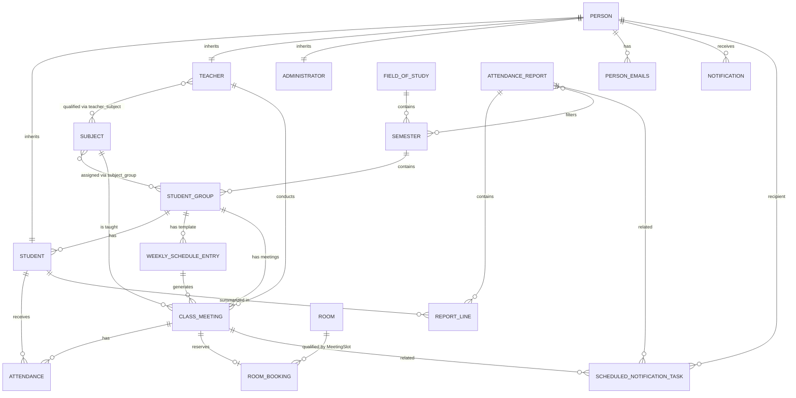

# University Academic Management System ERD Notes

Use `MAS_UNIVERSITY_ERD.dbml` as the source for ChartDB or dbdiagram-style ERD tools.

## How To Import Into ChartDB

1. Open ChartDB.
2. Create a new diagram.
3. Choose DBML import if available.
4. Paste the contents of `MAS_UNIVERSITY_ERD.dbml`.
5. Arrange the diagram into these visual areas:
   - Users and roles
   - Academic structure
   - Scheduling and attendance
   - Reporting
   - Rooms and bookings
   - Notifications

## Main Defence Points

### ERD Versus Class Diagram

The ERD shows the database structure, not every Java class as a separate box.

Some Java inheritance hierarchies are stored in one table. In those cases, the ERD should show the table and discriminator column, while the analytical and design class diagrams show the inheritance hierarchy.

### Users And Roles

`Person` is the superclass for `Student`, `Teacher`, and `Administrator`.

The implementation uses joined inheritance:

- `student.id` references `person.id`
- `teacher.id` references `person.id`
- `administrator.id` references `person.id`

Emails are stored in `person_emails`, which represents the multi-value attribute `Person.emails`. The `email` column is globally unique.

### MAS Requirement 4.2.4

The required GUI association is:

`StudentGroup 1 -> 0..* Student`

This is shown in the ERD as:

- `student_group.id`
- `student.group_id`

The GUI screen `GroupStudentsAssociationView` displays groups in a `ListView` and students in a `TableView`. Students are retrieved through `StudentGroup.getStudents()`, not by manually filtering all students.

### Teacher Specialization

`Teacher` and `Subject` have a many-to-many association through `teacher_subject`.

This means:

- A teacher can be qualified for multiple subjects.
- A subject can have multiple qualified teachers.
- A class meeting can only be created if the selected teacher is qualified for the selected subject.

This association is different from `ClassMeeting`.

`teacher_subject` means what a teacher can teach.

`class_meeting.teacher_id` means who teaches one concrete lesson.

### Weekly Schedule Versus Class Meeting

`weekly_schedule_entry` is the recurring template.

`class_meeting` is the concrete occurrence generated from the template.

Example:

- Weekly schedule entry: MAS tutorial every Monday 10:00-11:30.
- Class meetings: generated meetings on concrete dates during the semester.

This distinction is important because concrete meetings can later be cancelled, completed, commented, or used for attendance.

### Attendance

`attendance` connects:

- one `student`
- one `class_meeting`
- one attendance status
- one optional individual comment

The unique constraint on `(student_id, class_meeting_id)` prevents duplicate attendance records for the same student and meeting.

### Reporting

`attendance_report` stores selected report filters:

- semester through `attendance_report_semesters`
- teacher
- subject
- group
- class type
- date range

Nullable filter columns mean that the filter was not selected.

`report_line` stores detailed counts per student:

- total meetings
- present
- late
- excused
- absent
- attendance percentage

The overall report performance is stored in `attendance_report.overall_performance_percentage`.

### Room Qualified Association

The qualified association is:

`Room [MeetingSlot] -> RoomBooking`

In the ERD this is represented by:

- `room`
- `room_booking`
- unique key `(room_id, date, start_time, end_time)`

The qualifier is the meeting slot:

- date
- start time
- end time

This guarantees that one room cannot have two bookings for the exact same time slot.

### Notifications

`notification.recipient_id` references `person.id`, so notifications can be sent to students, teachers, or administrators.

`EmailNotification` and `SystemNotification` do not appear as separate ERD tables because the implementation uses single-table inheritance:

- Java superclass: `Notification`
- Java subclasses: `EmailNotification`, `SystemNotification`
- Database table: `notification`
- Discriminator column: `notification_type`
- `EMAIL` rows represent `EmailNotification`
- `SYSTEM` rows represent `SystemNotification`
- `has_attachment` is specific to email notifications
- `display_seconds` is specific to system notifications

This is correct for an ERD of the physical database schema. The class diagrams show the inheritance relationship explicitly.

`scheduled_notification_task` stores pending work for `SystemScheduler`, such as:

- class meeting reminders
- low attendance warnings
- attendance registered/updated messages
- report-ready messages

## Mermaid Overview

This simplified overview is useful for documentation, but the DBML file is better for the full ERD.

